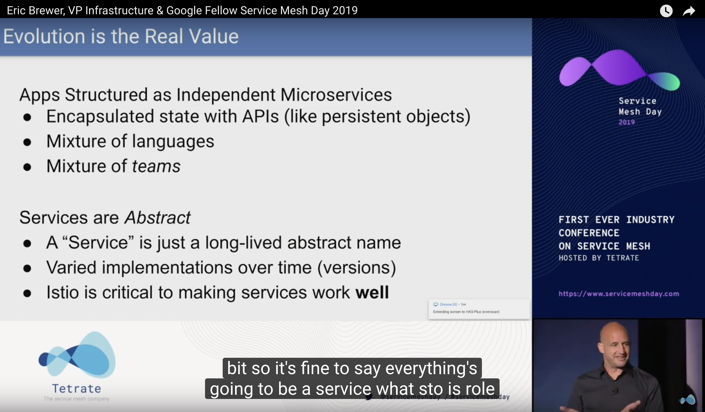
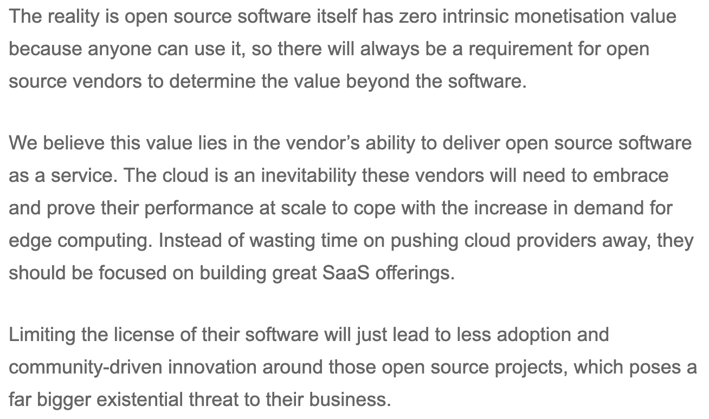

[Conway](https://twitter.com/conways_law/status/1238539198203822081)

[Developer Experience](Developer%20Experience.md)

[Services](Services.md)

](https://www.youtube.com/watch?v=do-PrVi0ifk "Eric Brewer, VP Infrastructure & Google Fellow")

 <b>Google: 100,000+ services - Networking In & Across Regions </b>

 

 <a href="https://monzo.com/blog/we-built-network-isolation-for-1-500-services">Microservices: A Modern App, Monzo Bank: 1,600+ services - A visualisation of network of microservices w/ Strong DevOps & Observability</a> 

[Data Intensive](Data-Intensive.md)

[Cloud Computing](Cloud%20Computing.md)

[Open Source](Open%20Source.md)

[Operations](Ops.md)

[Systems Thinking](Systems%20Thinking.md)

# Academic:
## Stanford
 * [Value of Data and AI](https://canvas.stanford.edu/courses/114221)
 * [Principles of Data-Intensive Systems](http://web.stanford.edu/class/cs245/) 
 * [Knowledge Graphs](https://web.stanford.edu/class/cs520/)
 
 # Anti-patterns:
* A [big ball of mud](http://www.laputan.org/mud/) is a software system that lacks a perceivable architecture. Although undesirable from a software engineering point of view, such systems are common in practice due to business pressures, developer turnover and code entropy. They are a type of design anti-pattern.

# Cloud Computing:
| **Characteristics** | **Developer Productivity** |
|------------------------| ---------------------------------------------------------------------------------------------|
| **On-demand self-service** | A consumer can unilaterally provision computing capabilities, such as server time and network storage, as needed automatically without requiring human interaction |
|**Broad network access**|Capabilities are available over the network and accessed through standard mechanisms|
|**Resource pooling**|The provider’s computing resources are pooled to serve multiple consumers using a multi-tenant model, with different physical and virtual resources dynamically|
|**Rapid elasticity**|Capabilities can be elastically provisioned and released to scale rapidly outward and inward with demand|
|**Measured service**|Cloud systems automatically control and optimize resource use by leveraging a metering capability (typically per-per-use)|
## [NIST - standards & guidelines](https://nvlpubs.nist.gov/nistpubs/Legacy/SP/nistspecialpublication800-145.pdf)

 

### 
<b>- Ali Ghodsi, Co-founder & CEO at data science, big data processing and machine learning company Databricks.</b>

