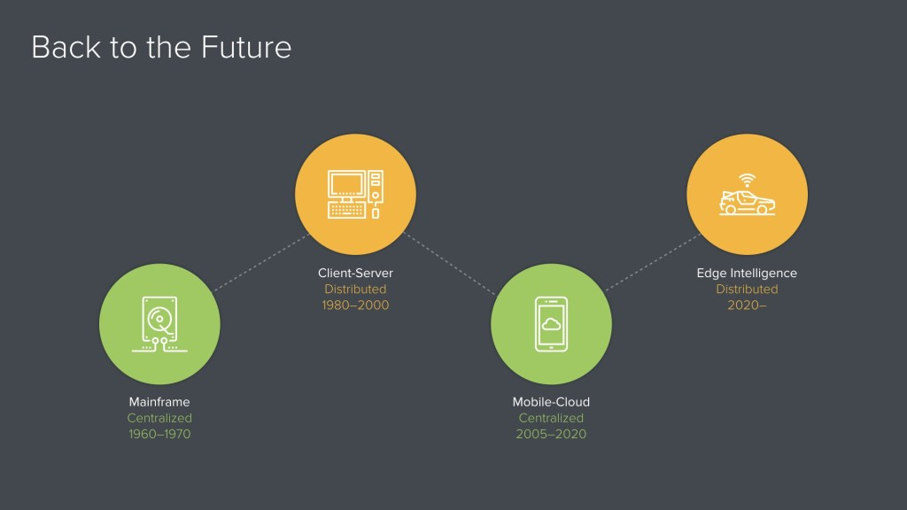

# distributed systems architecture for Highly Autonomous Systems

Peter Levine, general partner at Andreessen Horowitz -> ["I'm going to take you out to the edge to show you what the future looks like."](https://a16z.com/2019/11/15/the-end-of-cloud-computing-2/)

As a strategy formulation, we are trying to change a **situation A** into a better **situation B**. This process might end in the real world, but it starts in our imaginations, in the **virtual world**. This is a straw man proposal of such a virtual world in the context of new generation of Sensors, Edge, 5G Rollout & Cloud  to aid in decision making for design, develop, and deploy model of **Business Applications** backed by an **IoT Cloud Platform**. The proposal is aligned with [Design Heuristics](Stuff.md), will be refined over time after feedback & deeper understanding of real world.

## 1.	Edge & Cloud Computing - Edge, everything that is not cloud, deploy workloads closer to users and devices, Why? - Latency, Availability & Data Locality.
Edge Workloads:
* Limited number of Nodes, No Autoscaling

* Data Ingestion & Processing: Protocol conversion / Data preprocessing

*	Reliability & Availability: Store & forward / Caching, Local DB & Sync data

*	Latency: Edge Functions, React locally on sensor or scheduled events / Edge specific training (environment & data policies)

Cloud Workloads:
-	Autoscaling
-	Authentication & Authorization
- Device Management
- Workflows & Integrations
-	Storage & ML Training

## 2.	Open Source Software

1. The Linux Foundation is Building an Open SourceFramework for the Edge, [LF Edge aims to establish an open, interoperable framework for edge computing independent of hardware, silicon, cloud, or operating system](https://github.com/lf-edge)

* https://www.infoq.com/presentations/linux-eve/ 
* https://www.lfedge.org/wp-content/uploads/2020/07/LF-Edge-web-july2020.pdf

2. Eclipse Foundation [IoT working group](https://iot.eclipse.org/) has been around for 8 years, also started contributing to CNCF (more below). Currently host 37 Projects, following look interesting.

* DSL - https://vorto.eclipse.org/
* IoT GW - https://www.eclipse.org/hono/
* Microservices framework - https://iofog.org/
* Microservices - https://www.eclipse.org/ditto/
  * Policies - persistence of Policies
  * Things - persistence of Things and Features
  * Thing-Search - tracking changes to Things, Features, Policies and updating an optimized search index + executes queries on this search index
  * Gateway - provides HTTP and WebSocket API
  * Connectivity - connects to AMQP 1.0 (e.g. Eclipse Hono) and AMQP 0.9.1 endpoints and consumes messages in Ditto Protocol from it, optionally converts other formats to Ditto Protocol
  * Concierge - orchestrates the backing persistence services (including authorization)

## 3.	Cloud Native & Edge Kubernetes synergies

Developers mindshare & Tooling, workloads can move between Cloud & Edge. Edge computing becoming an emerging trend, more and more developers trying to use Kubernetes outside typical data center deployments. And it makes sense, as people want to continue using all cloud-native best practices and tools that make them productive. 
Cloud Native Computing Foundation (CNCF) [IoT Edge working Group](https://github.com/kubernetes/community/tree/master/wg-iot-edge) is a community where all aspects of using Kubernetes in IoT and Edge use cases is discussed. [white paper](https://docs.google.com/document/d/1We-pRDV9LDFo-vd9DURCPC5-Bum2FvjHUGZ1tacGmk8/), few projects:

Kubernetes for Edge -  https://k3s.io/
-	[The Lightweight Kubernetes Distribution Built for the Edge](https://www.youtube.com/watch?v=WYPd7i15XOg) 

KubeEdge – https://kubeedge.io/en/
-	IoT Edge platform build on Kubernetes   

Virtual Kubelet – https://virtual-kubelet.io/
-	Framework for implementing alternative Kubelet implementations, Ex: Azure IoT Edge Connector for Kubernetes

Cloud Events – https://cloudevents.io/
-	https://cloudblogs.microsoft.com/opensource/2019/11/21/boosting-cloud-interoperability-cloudevents-v1-0-support-azure-event-grid/

Knative – https://github.com/knative/
-	Serverless workloads
-	Not paying for Idle resources
-	Use cases: Event handlers, scheduled jobs etc.

## 4.	Tech Stack & Deployment Architecture

**Cloud:** Azure, Evaluation to determine Build/Rent of critical capabilities like Kubernetes, Databases & Analytics.

**Edge:** TODO, after more study & analysis…

* Thinking about State - https://github.com/ankumar/Architecture/blob/main/Patterns/Stateful.md

