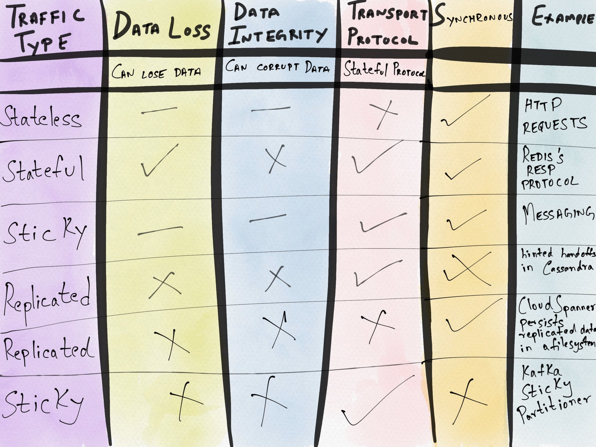

# “Stateful” ... 

A Formal Definition ...

1. Looked in [Designing Data-Intensive Applications](https://dataintensive.net/) Book

2. https://12factor.net/processes - Twelve-factor processes are stateless and share-nothing. Any data that needs to persist must be stored in a stateful [backing service](https://12factor.net/backing-services), typically a database.

3. An ontology of “stateful” systems ... 
* All systems are stateful. They only differ in the time it takes to restore state, when it was lost.
* All stateless systems are stateless in no more than 4 ways.
* All stateful systems are stateful in ... 21 possible ways?
  * With examples from Kafka (sticky partitioning), Cassandra (hinted handoffs).
* [A Paper - Locality, Statefulness, and Causality in Distributed Information Systems](https://arxiv.org/pdf/1909.09357.pdf)

-- [Cindy Sridharan](https://twitter.com/copyconstruct)

## Application Data

**1. Data modeling** - typically needs to happen on (at least) two levels:

* On the **database** level
* On the **application** level (i.e., in your programming language)

The way how the application models are represented on both levels might differ due to a few reasons:

* Databases and programming languages use different data types
* Relations are represented differently in a database than in a programming language
* Databases typically have more powerful data modeling capabilities, like indexes, cascading deletes, or a variety of additional constraints (e.g. unique, not null, ...)
* Databases and programming languages have different technical constraints
    
**2. Data Access patterns** - Mapping between application & database structures. The two major categories are the [active record pattern](http://calpaterson.com/activerecord.html) and the [data mapper pattern](https://www.silasreinagel.com/blog/2018/11/12/using-orms-and-dtos-elegantly/). The Data model comprises of

1. Collection of application domain models like Customer, Order, Item, ...
2. Schema of the underlying database like in 
* Relational databases (like PostgreSQL), they are stored in tables.
* Document databases (like MongoDB), they are stored in collections.
* Big Table databases (like Cassandra), Keyspace is an object that holds together all column families (or tables) of a design.

## Distributed Data Management 
In a microservice architecture each service’s database is private to that service in order to ensure loose coupling. As a result, it’s challenging to implement transactions and queries that span services. The solution is to implement distributed transactions using the [Saga pattern and queries using the CQRS pattern](https://microservices.io/articles/applying.html).

https://docs.microsoft.com/en-us/dotnet/architecture/cloud-native/distributed-data

**1. CAP theorem**

[Approach #1 - Spanner and the CAP Theorem](https://cloud.google.com/blog/products/gcp/inside-cloud-spanner-and-the-cap-theorem)
   * Google’s Spanner globe-spanning relational database with nuclear-clock synchronized control plane.
   * Building systems that can manage data that spans the globe, provide data consistency and are also highly available is possible; it’s just really hard. **The beauty of the cloud is that someone else can build that for you, and you can focus on innovation core to your service or application.**

[Approach #2 - Physalia and the CAP Theorem](https://www.amazon.science/blog/amazon-ebs-addresses-the-challenge-of-the-cap-theorem-at-scale)
   * Physalia focus & key design goal again for availability on placement for 'blast radius', the number of cells than any one failure (software, infrastructure, etc) can touch. Geo-replicated systems can have similar concerns.
   * Physalia database underpinning EBS takes a very different approach that creates a massively parallel and intelligently placed metadata that migrates along with the actual EBS storage chunks and therefore radically minimizes the blast radius of an outage with the storage service.
   * Physalia's design came as a result of thinking deeply about the CAP theorem and other constraints. Physalia needs to be consistent (C), so the way to get real-world availability is to reduce the probability of being affected by a network partition. 
   * Physalia's approach to this is to optimize the placement of database nodes relative to their clients and peers, having just the right amount of network between them.
   * A network partition "over there" doesn't prevent us from offering both C and A "over here". 
   * **There is no open source implementation yet.**
   
**2. Data Consistency**

**"In an “always-on” world, downtime is unacceptable, and developers were forced into handling the reduced consistency levels of scalable NoSQL systems" . 
"Over the past decade, application developers have discovered that it is extremely difficult to build bug-free applications over database systems that do not guarantee consistency."**
http://dbmsmusings.blogspot.com/2018/09/newsql-database-systems-are-failing-to.html?m=1

* [Distributed Sagas: A Protocol for Coordinating Microservices](https://www.youtube.com/watch?v=0UTOLRTwOX0)
    * Models - Events/Choreography , Command/Orchestration
    * "application-level, mechanisms for maintaining database integrity" - http://www.bailis.org/papers/feral-sigmod2015.pdf
    * The biggest barrier ...  is that the consistency mechanism must **integrate consistency across many stateful services** - https://research.fb.com/wp-content/uploads/2016/11/challenges-to-adopting-stronger-consistency-at-scale.pdf
    * [1987 paper “Sagas”](http://www.cs.cornell.edu/andru/cs711/2002fa/reading/sagas.pdf)

* [Using Sagas](https://chrisrichardson.net/post/microservices/2019/07/09/developing-sagas-part-1.html), Implementations:
    * https://medium.com/@omererakman/saga-pattern-2413e636ab16
      * https://eventuate.io/docs/manual/eventuate-tram/latest/getting-started-eventuate-tram-sagas.html
      * https://github.com/eclipse/microprofile-lra
    * [A Distributed Transaction Solution Open Sourced by Alibaba](https://seata.io/en-us/)
    * https://blog.bernd-ruecker.com/saga-how-to-implement-complex-business-transactions-without-two-phase-commit-e00aa41a1b1b
    * https://github.com/berndruecker/trip-booking-saga-java
    * https://zeebe.io/ 
    
* [GRIT: a Protocol for Distributed Transactions across Microservices](https://tech.ebayinc.com/engineering/grit-a-protocol-for-distributed-transactions-across-microservices/)

* [The World is Eventually Consistent, The Database as an Optimization](https://christophermeiklejohn.com/lasp/erlang/2015/10/27/tendency.html)

**3. Event-driven/Async**

Span Multiple Requests/Workflow
  * [AsyncAPI specification](https://www.asyncapi.com/)
  
**4. Separation of storage and compute**
  * [Mind Your State for Your State of Mind](https://queue.acm.org/detail.cfm?id=3236388)

**5. Deleting Data** - (Ex: CCPA, ...) 

Cross cutting concerns - Data Catalog of Online microservices & Offline Warehouses;Data Discoverability, Access & Processing - An Abstraction ... 
* [Twitter Use-case](https://blog.twitter.com/engineering/en_us/topics/infrastructure/2020/deleting-data-distributed-throughout-your-microservices-architecture.html) 

## DBaaS

[Purpose-built Databases](../System/Databases.md)
   
