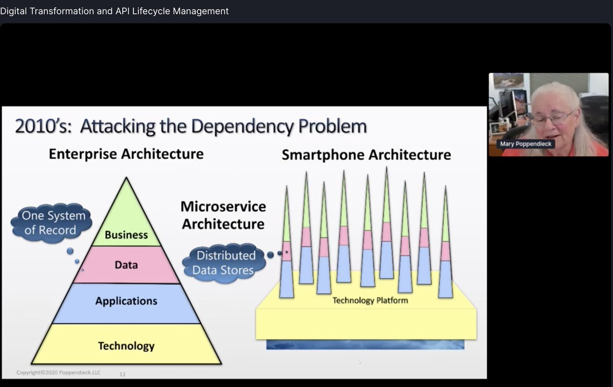

# System - Design Heuristics

consistent, short-term, incremental <b>“roofshots”</b> that make Product better year after year ... 
 

1. [Patterns](Design%20Patterns.md)
2. **Functions & Workflows ...** 

## 1. Software-Intensive:

Cloud native technologies empower organizations to build and run scalable applications in modern, dynamic environments such as public, private, and hybrid clouds. **Containers, service meshes, microservices, immutable infrastructure, and declarative APIs exemplify this approach.** These techniques enable loosely coupled systems that are resilient, manageable, and observable. Combined with robust automation, they allow engineers to make high-impact changes frequently and predictably with minimal toil. 

-- [CNCF Cloud Native Definition](https://www.cncf.io/)

**Services -** 
There isn't a concrete, well-defined algorithm for [decomposing](https://blog.acolyer.org/2016/09/05/on-the-criteria-to-be-used-in-decomposing-systems-into-modules/) [a system](https://queue.acm.org/detail.cfm?id=3395214) into [services](Modeling.md). As with much of software development, it's something of an art. If you decompose a system incorrectly, we have a distributed monolith, a system consisting of coupled services that must be deployed together. A distributed monolith has the drawbacks of both the monolithic and the Microservices architectures.

 <b> "APIs have replaced the central database in an enterprise's business operations." </b> 

* **gRPC, OpenAPI & REST**:
  * [OpenAPI](https://github.com/OAI/OpenAPI-Specification/)
  * [Event-driven/Async](https://www.asyncapi.com/)
  * More Styles:
    * RPC-Style, Ex: [Slack's API](https://api.slack.com/web)
    * [API Management](https://cloud.google.com/blog/products/api-management/understanding-grpc-openapi-and-rest-and-when-to-use-them)
* [Span Multiple Requests/Workflow](Workflow.md)
* **Declarative**:
  * [Apps - GraphQL](GraphQL.md)  
  * [Infra - Kubernetes Style](https://kubernetes.io/docs/concepts/overview/kubernetes-api/)  
   
-> [Developer Workflows](Run.md)
      
## 2. Data-Intensive:
Data powers new innovations, improvements in customer experience, and efficiency. Small advantage in data and algorithms result in increased customers/business success which in turn results in more data. This virtuous cycle due to positive feedback loop amplifies a company's competitive advantage, making data one of the key ingredients in building companies that have Increasing Returns instead of commonly seen Decreasing Returns.

 <a href="https://www.itsonlyamodel.com/">"All models are wrong, but some are useful."</a> 

### Advances in machine learning (ML) over the last decade have opened up a radically new approach to building software systems. Dubbed [“Software 2.0”](https://medium.com/@karpathy/software-2-0-a64152b37c35), this approach focuses on training models to learn from data instead of explicitly writing code for the required behavior. 
## > a. Data Validation

 <b> "In traditional software engineering, or Software 1.0, a program’s functionality is defined via code as dictated by a human. In the age of machine learning, we are increasingly observing Software 2.0 systems, where a program’s functionality is defined by the weights of neural networks as dictated by the data. You wouldn’t trust a piece of human-written code that hasn’t ever been debugged or tested, so why shouldn’t our data receive the same treatment now that it’s a first-class citizen in so many real-world systems?"

Data Quality problem categories:
- Data creation
- Data labelling
- Data manipulation
- Data quality evaluation 

**Examples:**
* [AI for Full-Self Driving - Data for STOP sign detection](https://www.youtube.com/watch?v=hx7BXih7zx8)

## > b. Software Engineering Practices

### 
 [Hidden Technical Debt in Machine Learning Systems](https://papers.nips.cc/paper/5656-hidden-technical-debt-in-machine-learning-systems.pdf) 

   
**Learning Systems** - Business, Infrastructure engineers, data engineers, and data scientists to seamlessly collaborate. 
* [Metaflow, a Human-Centric Framework for Data Science](https://netflixtechblog.com/open-sourcing-metaflow-a-human-centric-framework-for-data-science-fa72e04a5d9)
* [Determined: The Open Source Deep Learning Training Platform](https://determined.ai/developers/)

The goal of the platform is to enable Deep Learning Engineers to focus more of their time and energy on their ultimate goal — training high-quality models. They achieve this by tightly integrating all of the functionality DL Engineers need to train models at scale, including:
- High-performance distributed training that just works
- State-of-the-art hyperparameter search
- Experiment management with experiment tracking, log management, metrics visualization, reproducibility, and dependency management
- Flexibility - a fully open source system that supports both Tensorflow and PyTorch, and can run in the cloud or on-prem

---

3. [Glossary](Terminology.md)
