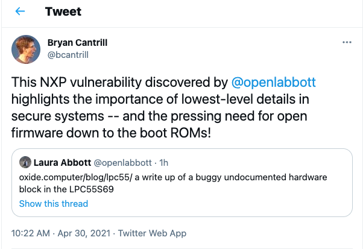
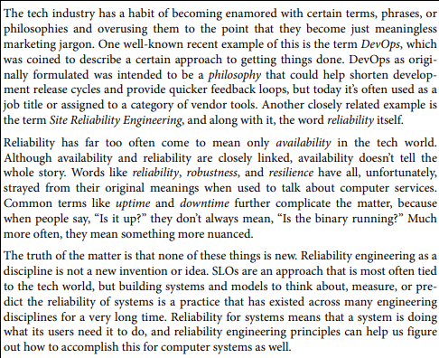
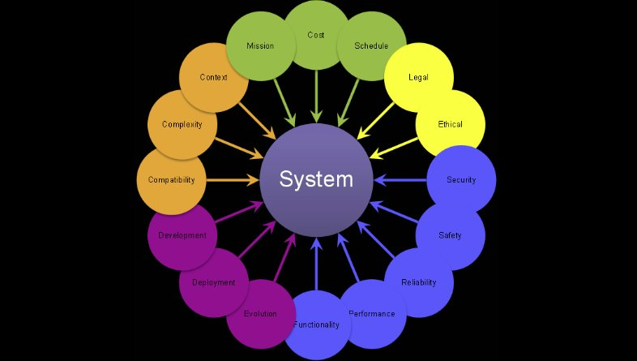

# Quality Attributes

## Collaboration

> The gap is widening, and there is no easy path to catch up. It's not for lack of technology, so there is no magic solution to buy. The necessary competence resides in product companies, so consultants is not the solution
>
> We need to find new ways to collaborate. We are trying one
>
> -- https://twitter.com/lalleal/status/1386411136199790592

**Few high performers, widening gap? agree with new ways to collaborate**. Organizational boundaries are getting blurred between "Public", "Private" spaces & Imperative considering Cognitive Load, Catch up, Open Source, Re Architecture, [Migration of workloads](https://www.sciencedirect.com/topics/computer-science/cloud-deployment-model) & [Cloud Computing](https://a16z.com/2019/11/15/the-end-of-cloud-computing-2/). 
- Developers/Experience: </>
- Data/Metadata: https://github.com/open-metadata/OpenMetadata
- Infrastructure/Software: </>

## Organization

> "Funding was stable, the way that Bell Labs was funded was that a very small tax was applied to any time you made a phone call in the United States a tiny slice of the money involved would go to Bell Labs to improve future telephone service and so that helped that meant that you could count on having revenue to support research for a long time , the organization was very stable , people stayed there for many many years & the company itself took an exceptionally broad and long-term view the job was to improve communication systems and that’s going to be a problem for a long time so almost anything you wanted to work on was arguably relevant to building better telephone systems and so that meant the company was not run by the quarter of a year it was run by multi-year period and all of this led to an environment which is also very cooperative and just plain fun. People enjoyed being there.."

-- [Brian Kernighan Unix: History and Memoir](https://youtu.be/nS-0Vrmok6Y?t=2010), Chapter 9 is pure gem **Legacy -> Technical, Organization, Recognition, Could history repeat?**
  - [Structure Eats Strategy](https://janbosch.com/blog/index.php/2017/11/25/structure-eats-strategy/)
  - [The next “next” generation](https://swardley.medium.com/how-organisations-are-changing-cf80f3e2300)
  - ["Open & Public"](https://en.wikipedia.org/wiki/Open_collaboration), Few examples:
    - [Sourcegraph](https://about.sourcegraph.com/about/)
    - [GitLab](https://about.gitlab.com/company/strategy/#why-is-this-page-public)

## Table stakes

-- [importance of lowest-level details in secure systems and the pressing need for open firmware down to the boot ROMs!](https://twitter.com/bcantrill/status/1388181932068929538)

- [Privacy](https://dbpedia.org/page/General_Data_Protection_Regulation), Collaboration, Security & Ethics
- Applications - Interoperability with [Open APIs](https://www.youtube.com/watch?v=LzMp6uQbmns)
  - [Amazons](https://apievangelist.com/2012/01/12/the-secret-to-amazons-success-internal-apis/), [OpenID](https://openid.net/), [Banking](https://en.wikipedia.org/wiki/Open_banking), [Open Banking](https://blog.stoplight.io/open-banking-guide), [Healthcare](https://www.hl7.org/fhir/), IoT, ... / [Cloud](https://github.com/kcp-dev/kcp), ...

## Culture

> "culture is not a static ‘thing’ but something which everyone is constantly creating, affirming and expressing" -- Mary Douglas

**Culture is not a set of beliefs, a set of actions**
 
> Companies & Culture: What You Do Is Who You Are - a16z editor in chief Sonal Chokshi interviews a16z co-founder Ben Horowitz -- author of the book What You Do Is > Who You Are -- on whether companies and people can change; how the very thing that is your strength can also be your weakness; how startups evolve from pirates to > the navy; actions vs words and values; and more.
 
https://a16z.simplecast.com/episodes/what-you-do-is-who-you-are-companies-culture-book-computer-history-museum-6JfGIJJs

**Culture is "Code"**

What kind of development organization are you a part of: pathological, bureaucratic, or generative? https://qualitysafety.bmj.com/content/qhc/13/suppl_2/ii22.full.pdf

> I am reading a book that was recommended by Kumar, Anil called "[Accelerate - Building and Scaling High Performing Technology Organizations by Nicole Forsgren, Jez Humble, and Gene Kim](https://www.amazon.com/Accelerate-Software-Performing-Technology-Organizations/dp/1942788339/)".  I am about 100 pages in and finally starting to understand the vision around our "destination" culture and honestly the "different cultures" that exist among our divisions.  
> On pg30 the book describes 3 types of organizational cultures.
> 1. **Pathological** (power oriented) organizations are characterized by large amounts of fear and threat.  People often hoard information or withhold it for political reasons, or distort it to make themselves look better.
> 2. **Bureaucratic** (rule-oriented) organizations protect departments.  Those in the department want to maintain their "turf", insist on their own rules, and generally do things by the book - their book.
> 3. **Generative** (performance-oriented) organizations focus on the mission.  How do we accomplish our goal?  Everything is subordinated to good performance, to doing what we are supposed to do.
> Moving forward in the book I'm learning about changes that need to be made around testing, version control, automation, CICD, communication, etc...  I am starting to be able to tie ideas that are nicely articulated in the book to statements I've heard in meetings by folks like Kumar, Anil, Raghavendra, Vijay, and Charlton, Paul.  Wow.  This is so cool...  It's like a giant light bulb turned on this week!
> I believe our destination culture is Generative.  I also feel that "we all kinda want it".  So, I'm getting excited about what the future holds...
> I recommend that all Tech managers & Architects get a copy of this book and read through it.
> Cheers!  ~https://www.linkedin.com/in/timothycdahl/
> 

## Non-Functional

> "We start by looking at which **“-ilities”** are most important to architects. A software architect is responsible for the cross-cutting concerns and making sure that individual components of a large system can work together seamlessly to meet overall objectives. In 2021, four areas we feel architects are concerned with are designing for resilience, designing for observability, designing for portability, and designing for sustainability." 

-- https://www.infoq.com/articles/architecture-trends-2021/

-- [From book Implementing Service Level Objectives](https://www.amazon.com/Implementing-Service-Level-Objectives-Practical/dp/1492076813)

## Functional

> "if building a software-intensive system, these are the forces we must weigh" https://twitter.com/ruthmalan/status/989206552044294145

* "On The Criteria for Decomposing Software" - Dr. David Parnas 1972 Paper:
  * [On the criteria to be used in decomposing systems into modules](https://blog.acolyer.org/2016/09/05/on-the-criteria-to-be-used-in-decomposing-systems-into-modules/)
  * [45m podcast of selected readings from this paper](https://podcasts.apple.com/us/podcast/on-the-criteria-to-be-used-in-decomposing-systems/id1364166414?i=1000527256187)
* [Revisiting Information Hiding](https://link.springer.com/chapter/10.1007%2F978-3-642-22655-7_8)
* [The theory of graceful extensibility](https://link.springer.com/article/10.1007/s10669-018-9708-3)

## Build

> "Instead of amplifying the constant whining about how everything is broken, we should be encouraging people to learn how to navigate ambiguity and mess. Software isn’t perfect, won’t ever be perfect, and perhaps isn’t meant to be perfect. Let’s learn how to better deal with it. Not to be confused with learning how to survive in toxic or dysfunctional workplaces. That’s different. Felt I had to say it, because inevitably someone will be in my mentions talking about how some things can’t be fixed and it’s better to cut your losses soon. "
> -- https://twitter.com/copyconstruct/status/1416095406610554880

> "The most common questions I get from customers – whether it be developers or executives – are targeted at understanding how Amazon is able to move so quickly. They want to know about our company culture, our organizational structure, the internal tools we use, and the type of people we hire, just to name a few. Of course, there’s no single answer here. Further, what might be a challenge at one company isn’t necessarily the same at another. But there’s one thing I’ve found that’s as close to a silver bullet as you can get – Developers. More specifically, it’s about hiring the right kinds of developers and then empowering them to do what they do best – build."
> –-[Supercharging Application Delivery](https://www.allthingsdistributed.com/2021/06/supercharging-application-delivery.html)."

* Product Strategy - Transparent Roadmap
  * https://github.com/aws?q=roadmap
  * https://github.com/github/roadmap

* Journey - Celebrate & Share
  * [A Conversation with Werner Vogels](https://queue.acm.org/detail.cfm?id=1142065)
  * [A Second Conversation with Werner Vogels](https://queue.acm.org/detail.cfm?id=3434573)
  * [The Amazon Builders' Library](https://aws.amazon.com/builders-library/)
   
* Platform Strategy - "Leverage"
  * [Open Software Design](https://notes.ceilfors.com/Open_software_design.html) -> https://upmo.com/dev/
    * [Architecture](https://www.mediawiki.org/wiki/Wikimedia_Architecture_Team#The_practice) 
    * [Tech Radar](https://opensource.zalando.com/tech-radar/)
  * [Open Source Culture](https://opensource.zalando.com/)

-- https://twitter.com/mjasay 

-- [Open Source & Community / Kelsey Hightower, Developer & Open Source Advocate, Google Cloud](https://www.youtube.com/watch?v=jiaLsxjBeOQ) 

https://cacm.acm.org/magazines/2021/7/253459-why-computing-students-should-contribute-to-open-source-software-projects/fulltext

> Developers are the creative workforce who can solve critical business problems and create hit products for customers — not just "code monkeys" who grind through rote tasks. Companies that bring software developers in as partners are winning.
> -- https://twitter.com/jeffiel/status/1418682712559398916

Scaling engineering teams [Circa 1994, Backyard at Yahoo!](https://github.com/ankumar/Architecture/blob/main/Patterns/History.md#platform--tools--yahoo), Now Backstage open source project Incubated by Spotify, Adopted as Runway@American Airlines, 

* https://engineering.atspotify.com/2021/03/16/happy-birthday-backstage-spotifys-biggest-open-source-project-grows-up-fast/
  * https://engineering.atspotify.com/category/backstage/
  * https://roadie.io/blog/developer-portals-are-a-superpower/

Likely termed **"Internal Platforms"** @Hundreds of organizations ...

## Learn

* **Improving Developer Experience** 
> The Case for ‘Developer Experience’
-- https://future.a16z.com/the-case-for-developer-experience/

> "There's a lot of hype around developer productivity platforms..."
-- https://twitter.com/martinfowler/status/1387041315196702720

* **Improving Analytics & Data**

-- https://ai100.stanford.edu/

* **Empowering Teams**

  * [List of Resources](https://github.com/ankumar/Architecture/wiki)

